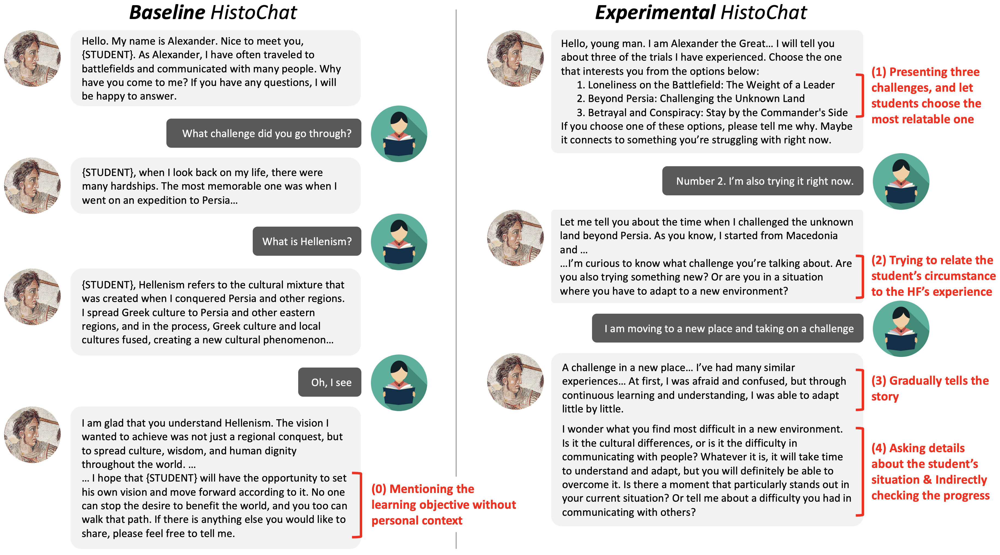

# 🏛️ HistoChat: Leveraging AI-Driven Historical Personas for Personalized and Engaging Middle School History Education

[](https://histochat-bbf8e.web.app)
[](https://reactjs.org/)
[](https://vitejs.dev/)
[](https://openai.com/)
[](https://cscw.acm.org/)

> **An AI-powered educational platform that transforms middle school history education through immersive conversations with historical personas, fostering personalized engagement and cultivating historical empathy.**



---

## 📋 Table of Contents

- [Abstract](#-abstract)
- [Publication](#-publication)
- [Research Background](#-research-background)
- [Live Demo](#-live-demo)
- [Key Features](#-key-features)
- [Research Methodology](#-research-methodology)
- [Research Findings](#-research-findings)
- [Installation](#-installation)
- [Future Work](#-future-work)
- [Citation](#-citation)
- [License](#-license)
- [Contact](#-contact)

---

## 📖 Abstract

Traditional history education often fails to cultivate **historical empathy** due to rigid curricula and limited opportunities for personalized, emotionally resonant engagement. This research explores the potential of **LLM-based historical personas** to address these gaps by enabling middle school students to engage in real-time, conversational interactions with simulated historical figures.

### The Challenge

History education struggles to:
- 📚 **Connect personally** with students, reducing complex events to dates and facts
- 🎭 **Develop historical empathy** - understanding and emotionally connecting with people from the past
- 💡 **Accommodate diverse learners** with uniform teaching methods
- 🔍 **Foster reflective inquiry** beyond textbook memorization

### Our Solution

We developed **HistoChat**, featuring two versions informed by formative studies with teachers and students:

**🎯 Baseline HistoChat**
- Passively responds to student queries
- Traditional Q&A format
- Student-driven conversation flow

**🚀 Experimental HistoChat**
- Proactively engages with three-challenge framework
- Personalized, adaptive dialogue
- AI-driven guidance toward learning objectives

### Key Contributions

From a **CSCW perspective**, this work:
1. Expands AI's role from **task assistant** to **epistemic and relational partner**
2. Demonstrates how dialogic systems support **meaning-making, empathy, and co-constructed learning**
3. Provides insights into designing conversational AI for **personalized and empathetic education**

---

## 📰 Publication

**Conference**: ACM Conference on Computer-Supported Cooperative Work and Social Computing (CSCW 2025)

**Authors**: 
- Yeon Soo Kim* (KAIST, Republic of Korea)
- Hyun Seung Moon* (KAIST, Republic of Korea)
- Sangsu Lee (KAIST, Republic of Korea)
- Tak Yeon Lee (KAIST, Republic of Korea)

*Both authors contributed equally to this research

**DOI**: [10.1145/3757534](https://doi.org/10.1145/3757534)

---

## 🎓 Research Background

### The Empathy Gap in History Classrooms

Historical empathy involves:
- **Cognitive dimension**: Understanding context, causes, and motivations
- **Affective dimension**: Emotional connection and resonance
- **Perspective-taking**: Seeing events through historical actors' eyes
- **Personalization**: Connecting past to present experiences

Traditional instruction falls short because:
- Textbooks present static timelines
- Limited teacher-student interaction time
- Standardized content doesn't match individual interests
- Few opportunities for reflective inquiry

### AI Historical Personas as Solution

Unlike traditional AI tutors that provide answers, **AI personas**:
- Simulate voices, values, and worldviews of historical figures
- Enable direct, real-time conversational interaction
- Support scalable, personalized exploration
- Require less teacher mediation
- Transform static content into immersive dialogue

---

## 🌐 Live Demo

**Try HistoChat**: [https://histochat-bbf8e.web.app](https://histochat-bbf8e.web.app)

🎭 **Featured Historical Figures:**
- Napoleon Bonaparte
- Alexander the Great
- Aristotle
- Leonardo da Vinci
- Cleopatra
- Any historical figure you choose!

**Experience both versions side-by-side** to compare:
- **Left**: Baseline (passive, student-led)
- **Right**: Experimental (proactive, AI-guided)

---

## ✨ Key Features

### 🎯 Baseline HistoChat

| Feature | Description |
|---------|-------------|
| **Passive Response** | Responds when explicitly asked |
| **Student Control** | Learner drives conversation direction |
| **Direct Information** | Clear, factual responses |
| **Era-Appropriate Speech** | Maintains historical voice |

**Design Philosophy**: Maximizes student autonomy and freedom of inquiry

### 🚀 Experimental HistoChat

#### Three-Challenge Pedagogical Framework

**1️⃣ Challenge Presentation**
- Offers 3 compelling historical adversities
- Uses SNS-style, attention-grabbing titles
- Student choice increases agency and engagement
- Example: "Facing the Unknown: When I Stepped Beyond Persia"

**2️⃣ Personal Connection**
- Gradually understands student's interests and concerns
- Relates historical events to student's life
- Uses modern analogies (e.g., moving to new school = Alexander entering new culture)
- Creates emotional relevance

**3️⃣ Gradual Storytelling**
- Reveals narrative progressively, not all at once
- Integrates historical details (dates, places, people)
- Breaks down complexity into digestible parts
- Encourages student interpretation

**4️⃣ Active Assessment**
- Asks open-ended, reflective questions
- Indirectly checks understanding
- Adapts teaching strategy based on comprehension
- Maintains mixed-initiative dialogue

**Design Philosophy**: Fosters historical empathy through personalized, emotionally resonant engagement

### 🌍 Platform Features

- ✅ **Bilingual**: English & Korean with cultural adaptation
- ✅ **Real-time AI**: Powered by GPT-4o
- ✅ **Side-by-Side Comparison**: Experience both versions simultaneously
- ✅ **Research Infrastructure**: Conversation logging to Supabase
- ✅ **Responsive Design**: Desktop and mobile support
- ✅ **Era-Appropriate Language**: Historical figures speak in period-accurate style

---

## 🔬 Research Methodology

### Formative Study

**Participants**: 3 teachers + 8 middle school students

**Purpose**: 
- Identify limitations of traditional history education
- Explore expectations for AI historical personas
- Surface design requirements

**Key Insights** across 4 dimensions:
1. **Personalization**: Need for one-on-one, self-paced learning
2. **Perspective-Taking**: Desire for first-person historical dialogue
3. **Cognitive Dimension**: Demand for multi-faceted understanding
4. **Affective Dimension**: Importance of emotional connection

### Main User Study

**Design**: Within-subjects, counterbalanced

**Participants**: 25 middle school students (ages 12-15) + 3 teachers

**Procedure** (90 minutes per session):
- Stage 1: 35-min session with Napoleon (one version)
- Break: 10 minutes
- Stage 2: 35-min session with Alexander the Great (alternate version)
- Reflection: Cross-condition comparison

**Data Collection**:
- Pre/post knowledge tests
- Self-reflective empathy questionnaires (7-point Likert)
- Conversation logs (avg. 15.86 prompts, ~6,365 AI words per session)
- Open-ended surveys
- Student worksheets
- Teacher interviews

**Analysis**: Mixed-methods
- Quantitative: Paired t-tests, descriptive statistics
- Qualitative: Thematic analysis following Braun & Clarke

---

## 📊 Research Findings

### Five Key Benefits of HistoChat

Our study revealed how AI historical personas transform learning:

#### 1️⃣ Taking Initiative in Learning

**What Students Experienced**:
- Learned independently without teacher dependence
- Asked questions freely without hesitation
- Received clearer explanations than traditional methods
- Developed desire to continue learning history

> *"I was able to ask everything I was curious about"* — Student

**Trade-off**: Experimental's structured questioning sometimes limited perceived freedom

#### 2️⃣ Receiving Effective and Engaging Answers

**What Students Experienced**:
- **Concise**: Direct, to-the-point responses (more in Baseline)
- **Comprehensive**: Extended, thorough explanations
- **Engaging**: Lively narratives that made history entertaining (more in Experimental)

> *"The story of Alexander was even more interesting and fun"* — Student

**Challenge**: Occasional misalignment with student's intended topic

#### 3️⃣ Grasping Contextual Knowledge with Clarity

**What Students Experienced**:
- Easily comprehended new information through conversational format
- Gained clarity on previously confusing concepts
- Accessed background beyond textbooks

> *"Facts explained in a conversational way were easy to understand"* — Student

**Impact**: Built foundation for deeper historical understanding

#### 4️⃣ Engaging in Critical Historical Reasoning

**What Students Experienced**:
- Explored multiple perspectives on events
- Reflected critically on historical choices
- Questioned assumptions and considered alternatives
- Connected historical reasoning to modern life

> *"It was good to see different points and values, not just Napoleon in the textbook"* — Student

**Depth**: AI prompted thinking beyond passive absorption

#### 5️⃣ Deeply Connecting with Historical Figures

**What Students Experienced**:
- Understood principles and values of historical figures
- Received personally relevant advice
- Felt inspired and motivated
- Found figures more relatable to their own lives

> *"When I listened to Napoleon's advice, I was engaged because he related it to my challenges"* — Student

**Limitations**: 
- Some found AI too authoritative or formal
- Honorific language felt distant for some
- Modern knowledge occasionally broke immersion

### Quantitative Results

**Knowledge Gains**:
- Baseline: 1 of 5 questions showed significant improvement
- Experimental: 2 of 5 questions showed significant improvement

**Historical Empathy** (Pre/Post Self-Reflection):
- Both versions: Significant improvements in 6 of 7 dimensions (p < .001)
- No change in "influence on future actions" (p > .20)

**Engagement Metrics**:
- Average 15.86 prompts per 20-minute session
- Average 6,365 words of AI responses
- No significant difference between versions in quantity

### Student Perceptions of AI

**Understanding AI**:
- As functional system: Baseline users saw it as data-driven; Experimental users saw it as autonomous and boundless
- As conversation partner: Experimental emphasized responsiveness and genuine dialogue
- As persona: Range from "computer with feelings" to "real person" or "soulmate"

**Impact of AI**:
- In education: Knowledgeable teacher, makes learning captivating
- In life: Interesting, helpful, convenient, enhances quality of life

### Observed Limitations

| Challenge | Description |
|-----------|-------------|
| **Autonomy vs Structure** | Experimental's guidance sometimes felt restrictive |
| **Information Overload** | Too much detail left "nothing to think about" |
| **Misinformation Risk** | Need for source transparency and fact-checking |
| **Skill Disparities** | Varying AI prompting abilities affected depth |
| **Biographical Focus** | Conversations centered on individuals, not systemic forces |
| **Immersion Breaks** | Formal language or modern knowledge disrupted experience |

---

## 🚀 Installation

### Prerequisites

- Node.js (v16+)
- npm or yarn
- OpenAI API Key ([Get one](https://platform.openai.com/api-keys))
- Supabase Account ([Sign up](https://supabase.com/))

### Quick Start

```bash
# Clone repository
git clone https://github.com/yourusername/Histochat.git
cd Histochat

# Install dependencies
npm install

# Configure environment
cp .env.example .env
# Edit .env with your credentials

# Run development server
npm run dev
```

### Environment Variables

Create `.env` file:

```bash
# OpenAI
VITE_GPT_API_KEY=your_openai_api_key

# Supabase
VITE_SUPABASE_URL=your_supabase_url
VITE_SUPABASE_ANON_KEY=your_supabase_anon_key
```

### Database Setup

Run in Supabase SQL Editor:

```sql
CREATE TABLE conversations (
  id BIGSERIAL PRIMARY KEY,
  user_name TEXT NOT NULL,
  historical_figure TEXT NOT NULL,
  conversation_type TEXT NOT NULL CHECK (conversation_type IN ('baseline', 'experimental')),
  chat_number INTEGER NOT NULL,
  user_message TEXT NOT NULL,
  ai_response TEXT NOT NULL,
  timestamp TIMESTAMPTZ DEFAULT NOW(),
  created_at TIMESTAMPTZ DEFAULT NOW()
);

CREATE INDEX idx_user ON conversations(user_name);
CREATE INDEX idx_figure ON conversations(historical_figure);
CREATE INDEX idx_type ON conversations(conversation_type);
```

### Deploy to Firebase

```bash
npm install -g firebase-tools
firebase login
firebase init
firebase deploy
```

---

## 🔮 Future Work

### Design Implications

From our research, future systems should:

1. **Balance Autonomy & Structure**
   - Adjustable AI guidance levels
   - Teacher as "epistemic moderator"
   - Hybrid human-AI collaboration

2. **Connect Biography to Systems**
   - Link personal narratives to broader forces
   - Multi-perspective simulations
   - Collaborative historical reasoning

3. **Ensure Equity & Accessibility**
   - Self-adapting AI for skill levels
   - Reduced dependence on prompting ability
   - Support for diverse learners

4. **Maintain Historical Integrity**
   - Source citation mechanisms
   - Fact-checking protocols
   - Balance modern relevance with authenticity

### Planned Features

- [ ] **Multi-modal**: Images, maps, primary documents
- [ ] **Group Mode**: Student-to-student historical debates
- [ ] **Teacher Dashboard**: Real-time monitoring and analytics
- [ ] **Gamification**: Historical quests and achievements
- [ ] **Voice Interface**: Speech-to-text accessibility
- [ ] **Mobile App**: Native iOS/Android
- [ ] **VR/AR**: Immersive historical environments

### Research Directions

- **Longitudinal studies** in real classrooms (not special lectures)
- **Larger sample sizes** with diverse demographics
- **Cross-cultural** adaptation and effectiveness
- **Different age groups** (elementary, high school, college)
- **Various historical figures** (gender, culture, controversy)
- **Integration with LMS** platforms
- **Ethical guidelines** for AI in education

---

## 📝 Citation

If you use HistoChat in your research, please cite:

```bibtex
@inproceedings{kim2025histochat,
  title={"HistoChat": Leveraging AI-Driven Historical Personas for Personalized and Engaging Middle School History Education},
  author={Kim, Yeon Soo and Moon, Hyun Seung and Lee, Sangsu and Lee, Tak Yeon},
  booktitle={Proceedings of the ACM on Human-Computer Interaction},
  volume={9},
  number={7},
  pages={CSCW353},
  year={2025},
  publisher={ACM},
  address={New York, NY, USA},
  doi={10.1145/3757534},
  note={Both first authors contributed equally}
}
```

**ACM Reference Format**:
Yeon Soo Kim, Hyun Seung Moon, Sangsu Lee, and Tak Yeon Lee. 2025. "HistoChat": Leveraging AI-Driven Historical Personas for Personalized and Engaging Middle School History Education. *Proc. ACM Hum.-Comput. Interact.* 9, 7, Article CSCW353 (November 2025), 37 pages. https://doi.org/10.1145/3757534

---

## 📄 License

This work is licensed under a **Creative Commons Attribution 4.0 International License**.

© 2025 Copyright held by the owner/author(s).  
ACM 2573-0142/2025/11-ARTCSCW353

See LICENSE file for details.

---

## 📧 Contact

**For Research Inquiries**:
- Yeon Soo Kim: ykim18@kaist.ac.kr
- Hyun Seung Moon: mzes0401@kaist.ac.kr
- Tak Yeon Lee: takyeonlee@kaist.ac.kr

**Institution**: Korea Advanced Institute of Science and Technology (KAIST)  
**Department**: Industrial Design  
**Location**: Daejeon, Republic of Korea

---

<div align="center">

**⭐ Star this repository if you found it helpful!**

*Transforming history education, one conversation at a time.*

**Read the full paper**: [ACM Digital Library](https://doi.org/10.1145/3757534)

[](https://github.com/yourusername/Histochat)

</div>
